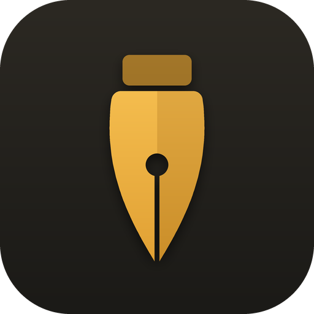
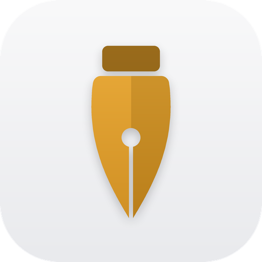
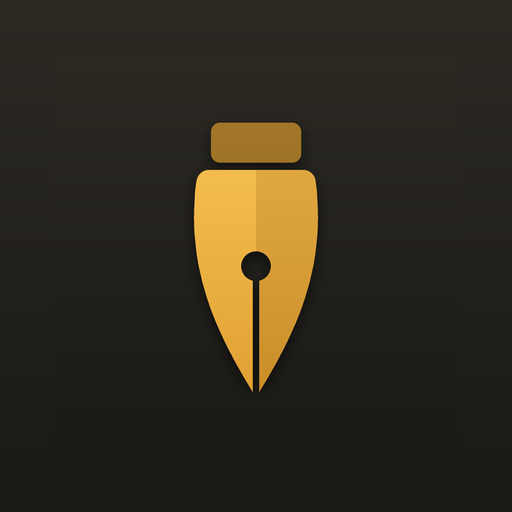
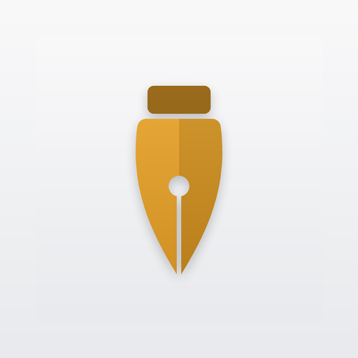
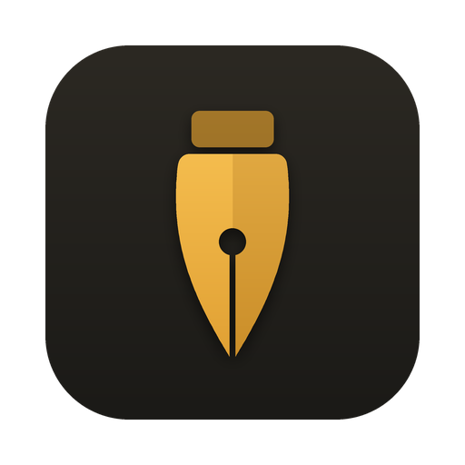
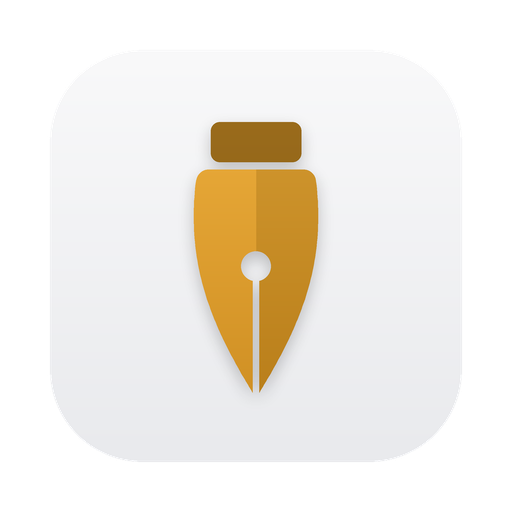

  <picture>
    <source media="(prefers-color-scheme: dark)" srcset="assets/icon-dark.png">
    <source media="(prefers-color-scheme: light)" srcset="assets/icon-light.png">
    
  </picture>

# Nib — AI Code Text Editor

**An AI code text editor that opens instantly and never loses your work.** Built with Tauri and Rust — a few MB per platform — for macOS, Windows and Linux.

**Download 0.4.4:** [latest release](https://github.com/JKS-sys/nib-22-sep-2026-releases/releases/latest) · [ipconfig.co.network/nib](https://ipconfig.co.network/nib)

| Platform | File |
|---|---|
| macOS Apple Silicon | `Nib_0.4.4_aarch64.dmg` |
| macOS Intel | `Nib_0.4.4_x64.dmg` |
| Windows | `Nib_0.4.4_x64-setup.exe` |
| Linux | `Nib_0.4.4_amd64.AppImage` / `.deb` |

First launch on macOS: if it says Nib is damaged, run `xattr -cr /Applications/Nib.app`.

## Features

- **AI as you type** (Pro) — suggestions appear as faint text, Tab accepts; plus Explain, Fix, Generate and Ask about your code
- **13 offline AI models** to download, run and remove on your own computer — Qwen2.5 Coder (0.5B–14B), DeepSeek Coder, StarCoder2, CodeGemma, Llama 3.2, Phi-3.5, Gemma 2 — free and private, with fill-in-the-middle completion that reads the code after your cursor too
- **GitHub Copilot** — sign in with GitHub and use your Copilot plan, or add any AI service by its URL
- **Always knows what is unsaved** — compared with the file on disk, not guessed: a change gutter, Compare with Saved, and a warning when another app changes the file
- **Never loses your work** — ⌘Q keeps unsaved and untitled files; they come back on the next launch
- **Split panes** — split right or down, drag a tab onto any side, resize, maximise; tabs move between windows, and windows merge
- **Named windows** — the Dock menu, Window menu and Mission Control show each window by name
- **Five colour variants** — Gold, Ocean, Ember, Violet, Calm — light and dark, a colour for each tab, never pink; rainbow brackets
- **80+ languages**, plain text and logs in colour, SQLite databases in a read-only viewer; keeps CRLF line endings and encodings
- Goto Anything, Goto Symbol, multi-cursor, find & replace with regex, find in folder, bookmarks, minimap, text tools
- Word completion from every open file, animations and sound effects, auto light/dark

**Free:** everything above except the items marked Pro, Find in Folder, Goto Symbol, multi-cursor tools, bookmarks, text tools, minimap, auto save and distraction-free mode.
**Pro (₹20/month or ₹220/year):** AI, plus all of those.

## What's new in 0.4.4

- Fixed: a file reopened after ⌘Q was shown as altered even when it matched the file on disk. Nib now compares your text with the file itself, so undoing back to the saved text clears the dot too
- Nib notices files changed by other apps (git, formatters, other editors): untouched tabs reload, tabs with your edits show a bar to compare, reload or keep yours — and a file that changed while Nib was closed is reported instead of silently overwritten
- Change gutter marks added, changed and removed lines; F7 / ⇧F7 jump between changes; Compare with Saved (⌥⌘D) shows the difference
- Saving keeps Windows (CRLF) line endings, UTF-8 byte-order marks and file permissions
- Split panes like Keel: Split Right (⌘\), Split Down (⇧⌘\), drag a tab onto any side of the editor, resize, maximise (⇧⌘↩), close a pane and the file stays as a tab
- Named windows (Window → Name Window…), Switch Window, Move Tab to New Window (or drag it out), Merge All Windows
- Five colour variants — Gold, Ocean, Ember, Violet, Calm — in light and dark, plus a colour for each tab; no pink anywhere
- AI (Pro): suggestions as you type (Tab accepts), plus Explain, Fix, Generate and Ask about your code
- 13 offline AI models to download, run and remove on your computer — Qwen2.5 Coder, DeepSeek Coder, StarCoder2, CodeGemma, Llama 3.2, Phi-3.5, Gemma 2 — with fill-in-the-middle completion for the most accurate suggestions
- GitHub Copilot: sign in with GitHub and use your Copilot plan; or add any AI service by URL
- Word completion from every open file, free and offline
- Animations and sound effects (Settings → Animations, Sounds)
- One About section with the app, these notes and the creator
- macOS: if Nib won't open after installing, run `xattr -cr /Applications/Nib.app`

## Icons — light and dark

| | Dark | Light |
|---|:---:|:---:|
| App icon |  |  |
| Dock icon |  |  |
| Web / install icon |  |  |
| Maskable |  |  |
| Window |  |  |
| Favicon |  |  |

See [RELEASE_NOTES.md](RELEASE_NOTES.md). Made by Jagadeesh Kumar S, creator · [YouTube](https://www.youtube.com/@JKS-sys)
