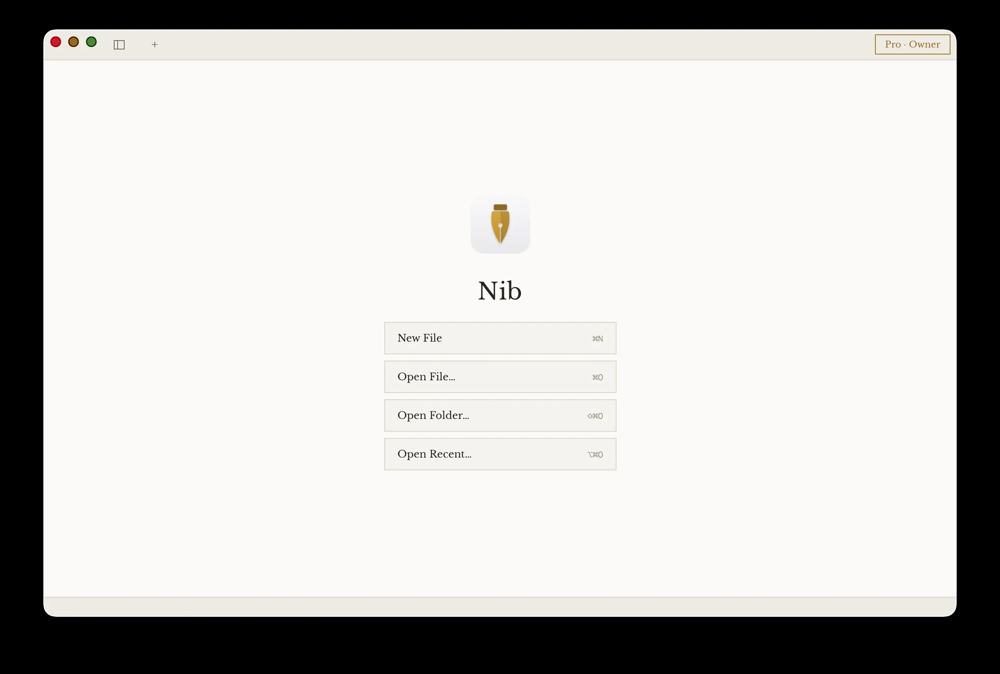
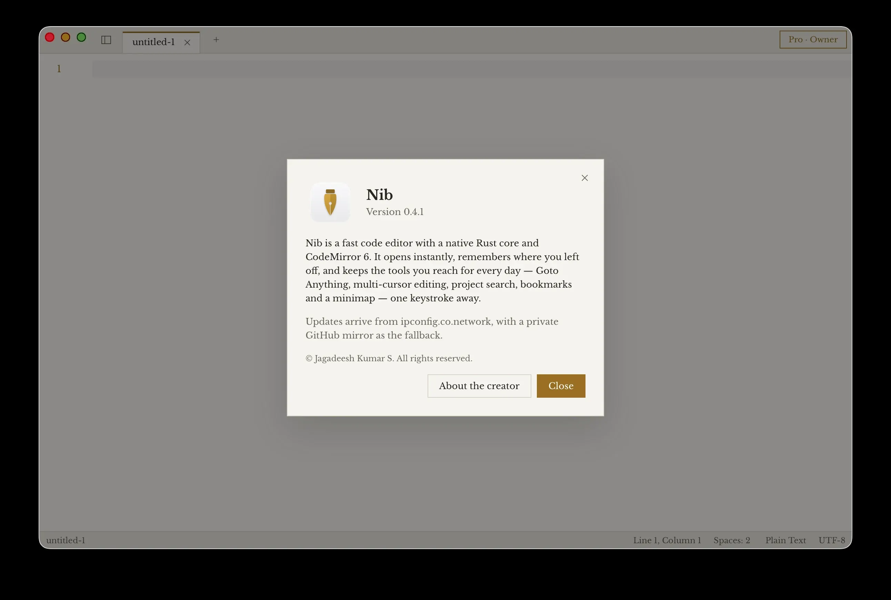
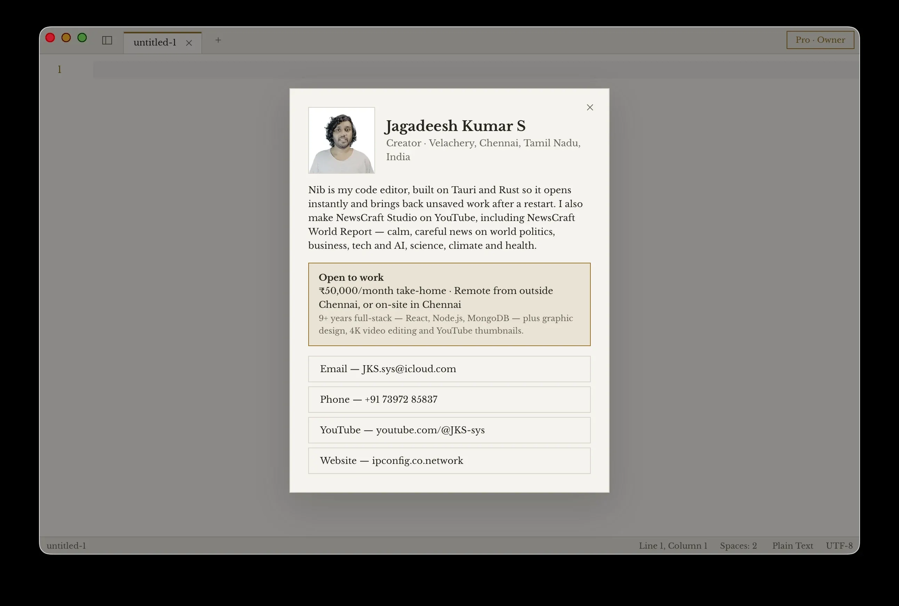

<p align="center">
  
  &nbsp;&nbsp;
  
</p>

# Nib — AI Code Text Editor

<p align="center">
  <a href="https://github.com/JKS-sys/nib-22-sep-2026-releases/releases/latest"></a>
  <a href="https://ipconfig.co.network/nib"></a>
  <a href="https://github.com/JKS-sys/nib-22-sep-2026-releases/releases"></a>
</p>

**An AI code text editor that opens instantly and never loses your work.** Built with Tauri and Rust — a few MB per platform — for macOS, Windows and Linux.

| | |
|---|---|
| Website | [ipconfig.co.network](https://ipconfig.co.network) |
| Nib's page | [ipconfig.co.network/nib](https://ipconfig.co.network/nib) |
| Releases | [github.com/JKS-sys/nib-22-sep-2026-releases/releases](https://github.com/JKS-sys/nib-22-sep-2026-releases/releases) |

## Install

**One command — macOS and Linux** (curl):

```sh
curl -fsSL https://raw.githubusercontent.com/JKS-sys/nib-22-sep-2026-releases/main/install.sh | sh
```

**One command — Windows** (PowerShell):

```powershell
irm https://raw.githubusercontent.com/JKS-sys/nib-22-sep-2026-releases/main/install.ps1 | iex
```

**macOS — Homebrew** (no tap, no extra repository — the cask file is right here):

```sh
curl -fsSL https://raw.githubusercontent.com/JKS-sys/nib-22-sep-2026-releases/main/nib.rb -o /tmp/nib.rb && brew install --cask /tmp/nib.rb
```

Update later with `brew upgrade nib` (Nib also updates itself).

**Download 0.4.10:** [latest release](https://github.com/JKS-sys/nib-22-sep-2026-releases/releases/latest)

| Platform | File |
|---|---|
| macOS Apple Silicon | `Nib_0.4.10_aarch64.dmg` |
| macOS Intel | `Nib_0.4.10_x64.dmg` |
| Windows | `Nib_0.4.10_x64-setup.exe` |
| Linux | `Nib_0.4.10_amd64.AppImage` / `.deb` |

- **macOS:** open the .dmg and drag Nib to Applications. If it says Nib is damaged, run `xattr -cr /Applications/Nib.app`.
- **Windows:** run the setup .exe.
- **Linux.** Install the `.deb` with your package manager, or make the AppImage executable and run it:
  ```sh
  sudo apt install ./Nib_0.4.10_amd64.deb
  # or
  chmod +x Nib_0.4.10_amd64.AppImage && ./Nib_0.4.10_amd64.AppImage
  ```

## Screenshots

<p align="center"></p>

**The start screen.** Nib opens straight to work: New File (⌘N), Open File (⌘O), Open Folder (⇧⌘O) and Open Recent (⌥⌘O), each with its shortcut. Your Pro plan shows at the top right, and with nothing open Nib is ready to type at once.

<p align="center"></p>

**About Nib.** The version you are running, what Nib is — a fast code editor with a native Rust core and CodeMirror 6 that opens instantly and remembers where you left off — and where its updates come from.

<p align="center"></p>

**About the creator.** Who makes Nib — Jagadeesh Kumar S, a creator in Velachery, Chennai — with his YouTube channel NewsCraft Studio, his website, and how to get in touch.

## Features

- **AI as you type** (Pro) — suggestions appear as faint text, Tab accepts; plus Explain, Fix, Generate and Ask about your code
- **AI chat beside any file** (Pro) — ask about it, or have it fill, add, change and delete things: spreadsheet cells and rows, document paragraphs, slides, text. Every change is shown first and undone with one ⌘Z
- **Voice** — dictate into any file or the chat (F8), and run spoken commands: “save”, “split right”, “go to line 40”, “new spreadsheet”, “start the slideshow” (⇧F8)
- **AI proofreading** (Pro) — correct the word, sentence or paragraph at the cursor, a selection or the whole file, and see every change word by word before applying it
- **Spreadsheets** — CSV, TSV, Excel (.xlsx .xlsm .xls), OpenDocument (.ods) and Apple Numbers files as a grid: 90+ Excel formulas, several sheets, sort, filter, fill, find & replace, number formats, frozen header, copy/paste with Excel
- **Numbers-style extras** — charts (column, bar, line, pie) that update as you type, checkbox, star-rating and progress-bar cells, conditional highlighting, summaries by category, and templates (budget, invoice, to-do, habit tracker, grade book)
- **Word documents** — open and edit .docx like Word: styles and headings, bold/italic/underline/strikethrough, colours and highlight, sizes, alignment, bulleted and numbered lists, tables, pictures, links, page breaks, word count, zoom, printing, and AI writing (correct, change tone, shorten, lengthen, continue, summarise)
- **Presentations** — open and edit .pptx like PowerPoint and Keynote: text boxes, shapes and pictures you move and resize, slide list, themes, transitions, and a full-screen presenter; AI turns an outline into slides
- **Word extras** — comments in the margin, footnotes and endnotes, Track Changes (record, accept, reject), and the header and footer with page numbers
- **PowerPoint extras** — speaker notes, charts drawn from their data (edit the numbers), tables you edit in place, SmartArt — all kept when saving
- **Old and Apple formats** — .doc, .ppt, .rtf, .odt, .odp, Pages and Keynote open and save back, using macOS's own converter, LibreOffice or Pages/Keynote when present; without any, the text of .doc and .ppt still opens
- **Spreadsheet charts and highlighting saved** — as real Excel charts and conditional formatting that Excel, Numbers and LibreOffice show
- **Password-protected Office files** — Excel, Word and PowerPoint files open with their password and save still protected (the same encryption Office uses)
- **Archives** — opening a zip extracts it beside itself (into its one folder, or a folder named after it) and the window closes; password-protected zips open; .rar, .7z and .tar files extract through the computer's own tools. **Compress…** makes a zip at the strongest setting (files that would not shrink are stored as they are), or tar.xz / tar.zst / 7z / RAR when those tools are present — always lossless, with the saving shown
- **Look Inside zips** — browse, sort, filter, extract only what you tick, and test every checksum
- **Pictures** — HEIC, TIFF and other formats the web view can't decode are converted for display; zoom, pan, rotate, flip, step through the folder with ← → or the mouse wheel, slideshow, full screen, a colour picker that copies any pixel's hex code, an info panel, checkerboard for transparency
- **Books** — EPUBs open with their table of contents, search across the whole book, scroll on past a chapter's end to turn the page, page colours (paper, sepia, night), line spacing, minutes left, text size and font choice, a reading-position memory and plain-text export
- **PDFs** — drawn by Nib itself on every system; scroll with the wheel or turn one page per notch in whole-page view, two-page spreads, night reading, full screen, reopens at your page; thumbnails, a contents panel from the PDF's bookmarks, find, zoom and selectable text; page tools: merge, extract, split, rotate, reorder, delete, page numbers, shrink, copy the text
- **Printing** (⌘P) — every kind of tab, with a live preview on paper: paper, orientation, margins, colour or black & white, a header on every page; code keeps its syntax colours and line numbers; sheets, slides (handouts, notes), PDF page ranges, pictures and books
- **Search the web** — DuckDuckGo, Bing, Google, Mojeek, Yahoo and Wikipedia asked at once; blocked engines are skipped and the rest merged, with sources in the AI chat
- **300 spreadsheet functions** — including money (PMT, FV, PV, NPER, RATE, NPV, IRR, depreciation), statistics (percentiles, correlation, regression, normal distribution), engineering (CONVERT, BIN/HEX/OCT, bit operations), dates (NETWORKDAYS, WORKDAY, YEARFRAC) and database functions (DSUM…), checked against LibreOffice Calc
- **Crash reports** — if Nib ever closes unexpectedly, it offers to send an anonymous report next time (version, system, the error and where — never your files); the owner reads them in the Owner Panel, in full, and exports them as .txt or .md
- **Owner Panel** (the owner's Mac only — its serial is the key, nothing to type) — its own window with licence codes (generate, revoke, restore, extend, annotate, delete), every subscription in detail with create / pause / resume / plan change / customer / note / issue code / cancel / delete, and the crash reports
- **Opens with a double-click** — Make Nib the Default Opener registers every type Nib handles: text and code, spreadsheets, Word and PowerPoint files (old and Apple formats too), pictures, PDFs, EPUBs and archives
- **Mouse page-turning** — the wheel, a swipe, or the mouse's Back / Forward buttons turn pages in PDFs, books, pictures and slides
- **Colour for early understanding** (never pink) — keywords, operators, punctuation and comments split by kind, TODO/FIXME tags, colour swatches you click to change, the word under the cursor echoed, sixteen file-kind colours across the side bar and tabs, rainbow brackets *and* indent guides (seven hues; the cursor's pair and block glow), a syntax-coloured formula bar in spreadsheets, coloured code in AI chat replies, a hue for each tab and status-bar item
- **Every local AI** — finds Ollama, LM Studio, Jan, GPT4All, LocalAI, llama.cpp, KoboldCpp, text-generation-webui, vLLM, LiteLLM, Msty and Llamafile running on your computer and uses their models in one click; pulls Ollama models by name; adds any GGUF model from Hugging Face (checksum-verified)
- **13 offline AI models** to download, run and remove on your own computer — free and private; or **GitHub Copilot**, or any AI service by its URL
- **Always knows what is unsaved** — compared with the file on disk, not guessed: a change gutter, Compare with Saved, and a warning when another app changes the file
- **Never loses your work** — ⌘Q keeps unsaved and untitled files, spreadsheets, documents and decks too; they come back on the next launch
- **Split panes**, **named windows**, **Markdown preview**, **five colour variants** with a colour for each tab, **thirteen sound packs**, **background sounds** (rain, ocean, brown noise, wind, fireplace, night), sparks as you type, a glowing cursor, file-type badges and animations throughout
- **80+ languages**, SQLite databases in a read-only viewer, side-bar file actions, Goto Anything (⌘T), multi-cursor, find in folder, bookmarks, minimap, JSON / Base64 / URL tools

**Free:** everything above except the items marked Pro, Find in Folder, Goto Symbol, multi-cursor tools, bookmarks, text tools, minimap, auto save and distraction-free mode.
**Pro (₹20/month or ₹220/year):** AI, plus all of those.

## What's new in 0.4.10

- Fixed: PDFs did not scroll at all — the viewer grew to the full height of every page and the window clipped it, so the mouse wheel had nothing to scroll. The viewer now fits its tab; a test wheels a real mouse over every viewer so this cannot come back unnoticed
- Fixed: rainbow brackets showed in one grey — the syntax colours were drawn over them. Brackets now take a different colour at each of seven depths, and the pair around the cursor glows in its colour
- Mouse page-turning everywhere: PDFs (whole-page view turns one page per wheel notch or swipe), books (scroll on past the end of a chapter — a gauge fills — to turn to the next; past the top for the previous, which opens at its end), pictures (the wheel steps through the folder; ⌘/Ctrl + wheel or a pinch zooms; a zoomed picture pans), slides and the presenter (the wheel moves between slides). The mouse's Back / Forward buttons turn pages in all of them; trackpad momentum turns one page, not twenty
- PDFs: Space / ⇧Space turn pages, middle-button or ⌥-drag moves the pages, two pages side by side, night reading, full screen (F), and each PDF reopens at the page you left
- Books: page colours (theme, paper, sepia, night), three line spacings, minutes left in the chapter and the book, the place in a chapter remembered, text size changes keep your place, Page Down / Space turn the chapter at its end, a coloured drop capital
- Pictures: slideshow through the folder (S), fill the window (F), full screen (⏎), a colour picker that copies the hex code of any pixel (P), arrows at the sides on hover, pictures slide in
- Many more colours, never pink: control keywords, import/export and declarations each in their own colour; method calls, classes, parameters, template strings and escapes; arithmetic, logic, comparison and assignment operators; commas and dots; doc comments; six heading levels. TODO, FIXME, NOTE, HACK, BUG and PERF in comments become coloured tags; colours in code get a swatch (click it to pick another colour); the word under the cursor is underlined wherever it appears; every tenth line number is tinted; autocomplete shows each kind of suggestion in its colour
- Every window speaks the same colours: sixteen file kinds each with their own hue in the side bar, tabs and recent files; folders take their level's colour with rainbow guides down the tree; book and Markdown headings by level; database columns and values (numbers, dates, booleans, JSON, links, text); viewer toolbars, the palette, Settings and the status bar
- Graphics: code glyphs drift behind the welcome screen and lean away from the pointer; a ring of ink bursts from the tab when you save; a glowing cursor (Settings); sparks as you type (Settings → Off / Subtle / Lively); a nib that writes while PDFs load; tabs lift and wear a cap in their colour; gradient dialog headings; find boxes glow through the hues
- Sounds: six new packs (Kalimba, Chime, Synth, Bubble, Piano, Wood block — thirteen in all) and new sounds for page and chapter turns (a paper rustle), zoom, the palette, find, Settings, new files, folders opening and closing, the side bar, bookmarks, printing, slideshows and the colour picker
- Background sounds, synthesised so nothing is downloaded: rain, ocean waves, brown noise, wind, fireplace and night (Settings → Background sound, with its own volume)
- New text tools in the palette: camelCase, PascalCase, snake_case, kebab-case, CONSTANT_CASE, URL slug, sort by length, shuffle, number lines, remove empty lines, escape / unescape HTML, sum the numbers in the selection, copy SHA-256; plus Next Colour Variant, Sparks and Background Sound commands

See [RELEASE_NOTES.md](RELEASE_NOTES.md). Made by Jagadeesh Kumar S, creator · [YouTube](https://www.youtube.com/@JKS-sys)
